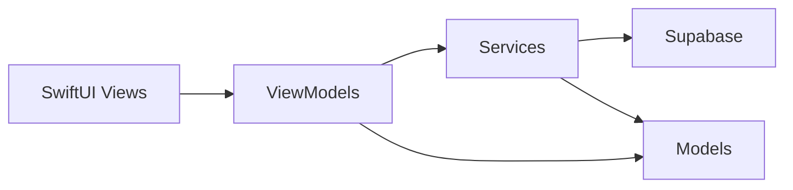

# MVVM Architecture

The Swift app uses a Model-View-ViewModel structure with Supabase isolated behind service types.

## Source Layout

- `Sources/ReviewAppSwift/Models`
  - Plain domain and transport models split by area: profiles, reviews, stories, social data, conversations, and date parsing.
  - Codable mapping for Supabase table/view payloads.
  - No SwiftUI state, no network calls.

- `Sources/ReviewAppSwift/ViewModels`
  - One `ObservableObject` per screen or user flow, such as session, timeline, review composer, profile, conversations, and chat.
  - Own screen state such as loading flags, selected tabs, form fields, and error messages.
  - Call services and transform results into published view state.

- `Sources/ReviewAppSwift/Views`
  - SwiftUI views only, grouped by feature folders: `Auth`, `Timeline`, `Reviews`, `Profile`, `Messaging`, `Settings`, and `Shared`.
  - Render view model state and forward user intents to view model methods.
  - Avoid direct Supabase queries or business rules beyond simple presentation choices.

- `Sources/ReviewAppSwift/Services`
  - Supabase client configuration and backend access split by domain service.
  - Auth, profile, follows, reviews, stories, notifications, and messaging operations.
  - Keep SQL/RPC/table naming details out of views and view models.

- `Sources/ReviewAppSwift/Support`
  - Shared UI theme and small extensions.

## Dependency Direction

Views depend on ViewModels and Models.

ViewModels depend on Services and Models.

Services depend on Models and Supabase.

Models do not depend on Views, ViewModels, or Services.

## Rules For New Features

1. Put new Codable entities in `Models`.
2. Put new Supabase calls in `Services`.
3. Put screen state and async orchestration in a `ViewModel`.
4. Keep SwiftUI views declarative and thin.
5. Do not call `SupabaseService.shared.client` directly from a View.
